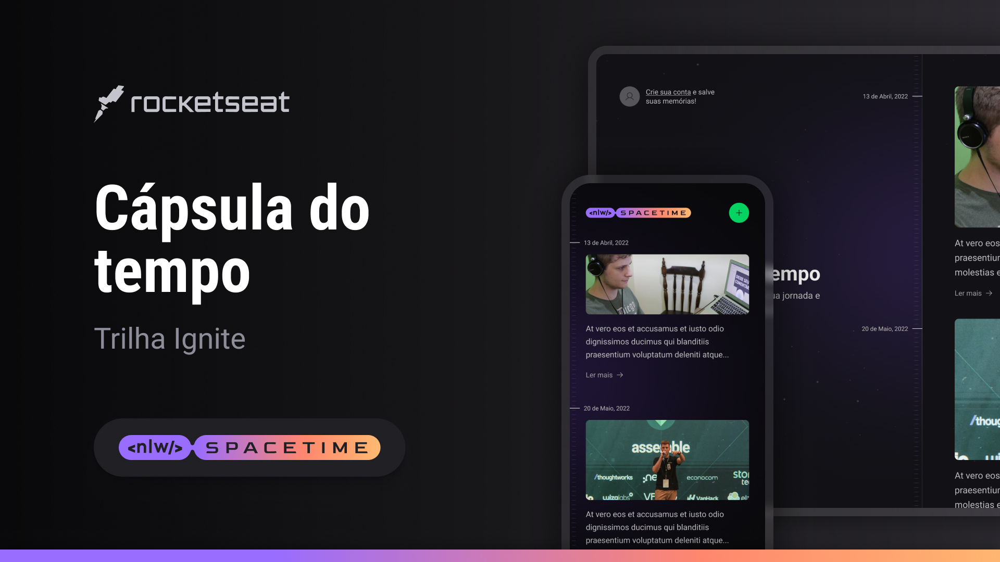

# NLW Spacetime

<div align="center">
  
</div>

## Sobre o Projeto

O projeto foi desenvolvido durante o NLW Spacetime da Rocketseat, onde a ideia principal é uma cápsula do tempo, na qual o usuário pode registrar momentos marcantes da sua vida em uma timeline.

## Tecnologias

**Front-end:** Nextjs, Typescript, TailwindCSS

**Back-end:** NodeJS, Typescript, Fastify, Prisma

**Mobile:** React Native, Expo, Typescript, Nativewind

## Comandos 

### server

```bash
# instalar as dependências
$ npm i
# iniciar o servidor
$ npm run dev
# setup prisma com flag SQLite
$ npx prisma init --datasource-provider SQLite
# migration
$ npx prisma migrate dev
# visualizar no banco de dados - Prisma Studio
$ npx prisma studio
```

### web

```bash
# instalar as dependências
$ npm i
# iniciar o servidor
$ npm run dev
```

### mobile

```bash
# instalar as dependências
$ npm i
# inicializar expo
$ npx expo start
```
## Referência

[Rocketseat](https://app.rocketseat.com.br/)
